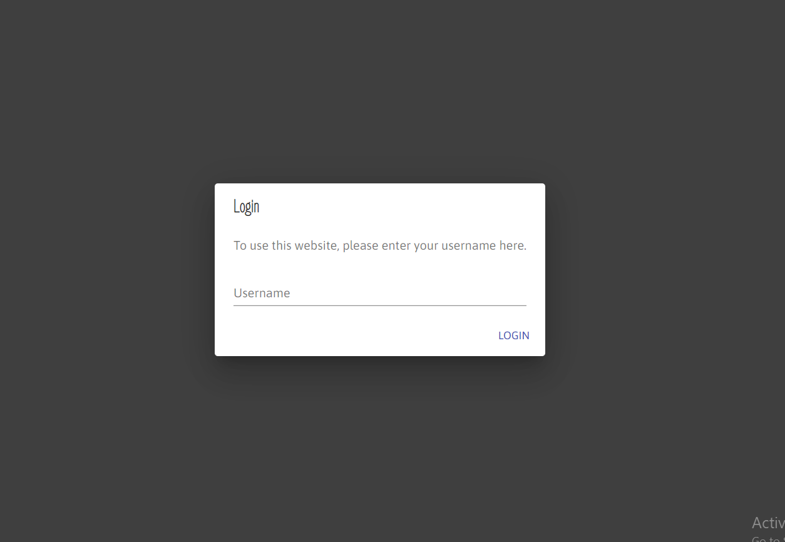
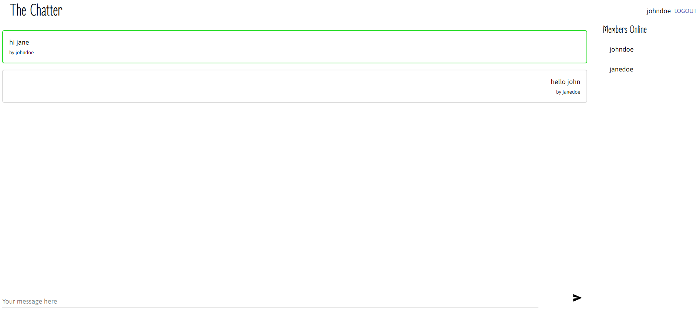
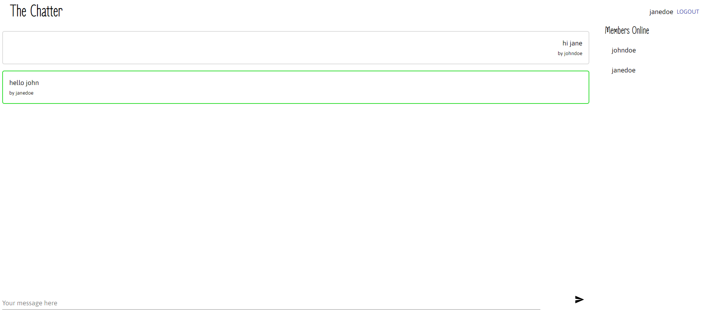

# The Chatting App

1. [Introduction](#introduction)
2. [Getting Started](#getting-started)
3. [Usage](#usage)
4. [Screenshots](#screenshots)
5. [Dependencies](#dependencies)

## Introduction

Login and Chat with your friends

## Getting Started

1. Clone the repo.

  `git clone`

2. Go to the project directory and install all the front-end dependencies using:

  `yarn`

3. Run the front-end using:

  `yarn start`

4. Change the directory to `/api` and install all the back-end dependencies using:

  `pip3 install -r requirements.txt`

5. Run the back-end using:

  `python3 api.py`

6. To connect to the Mongo database, Open `/api/config.py` and:

  - Change the value of DATABASE to your database name.

  - Change the value of DATABASE_HOST to your database host.

7. Run your database server

The app runs by default on http://localhost:3000

## Usage

The home page opens with a **Login** page. You can log in to talk to everyone else currently logged in.

## Screenshots

1. Login page

2. Chat page 1

3. Chat page 2

## Dependencies

### Tools

1. [Yarn](https://yarnpkg.com/)
2. [Python3+](https://www.python.org/downloads/)
3. [Pip](https://pip.pypa.io/en/stable/)
4. [MongoDB](https://www.mongodb.com/)

### Front-end

1. @material-ui/core ^4.12.1
2. @material-ui/icons ^4.11.2
3. @reduxjs/toolkit ^1.5.1
4. react ^17.0.2
5. react-dom ^17.0.2
6. react-redux ^7.2.3
7. react-scripts 4.0.3
8. socket.io-client ^4.1.3

### Back-end

1. bidict==0.21.3
2. click==8.0.1
3. colorama==0.4.4
4. Flask==2.0.1
5. Flask-Cors==3.0.10
6. Flask-SocketIO==5.1.1
7. itsdangerous==2.0.1
8. Jinja2==3.0.1
9. MarkupSafe==2.0.1
10. pymongo==3.12.0
11. python-engineio==4.2.1
12. python-socketio==5.4.0
13. six==1.16.0
14. Werkzeug==2.0.1
